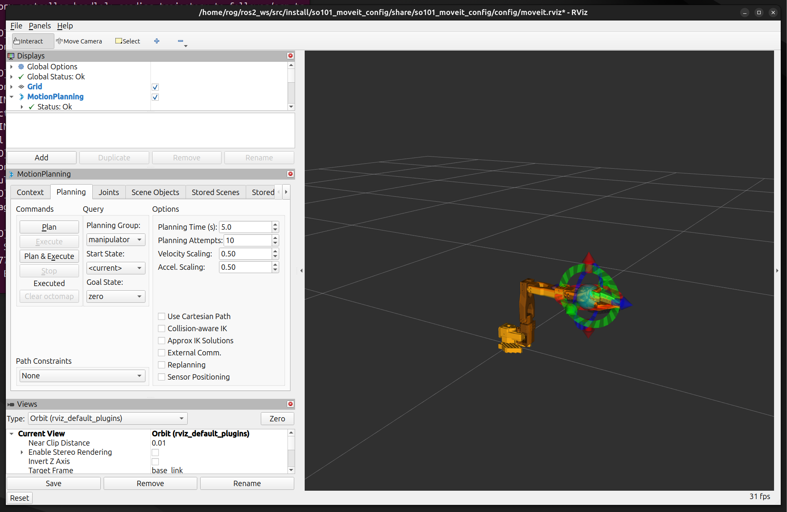

# HX35HM + SO101 控制栈 / Control Stack

这是 HX35HM + SO101 机械臂项目的控制与规划工作区。
This is the control and planning workspace for the HX35HM + SO101 arm project.

它主要包含这些部分：
It focuses on these parts:

- HX35HM 桥接与舵机控制 / HX35HM bridge and servo control
- ROS 2 启动与控制器 / ROS 2 bringup and controllers
- MoveIt 规划与执行 / MoveIt planning and execution
- 遥操作 / Teleop
- 抓取与标定工具 / Grasping and calibration tools

## 预览 / Preview




## 最短启动 / Quick Start

```bash
export ROS_WS="$HOME/ros2_ws"
cd "$ROS_WS/src"
source /opt/ros/jazzy/setup.bash
colcon build --symlink-install
source "$ROS_WS/install/setup.bash"
ros2 launch so101_bringup follower_hx35hm_moveit.launch.py \
  use_hx35hm:=true \
  use_cameras:=false \
  use_rviz:=true \
  use_joint_gui:=false \
  use_aruco_detector:=false \
  use_red_detector:=false
```

如果你只想看完整的操作顺序，请打开：
If you only want the full operator workflow, open:

- [HX35HM_SO101_MoveIt规划控制启动流程.md](src/HX35HM_SO101_MoveIt规划控制启动流程.md)

## 仓库内容 / What Is Inside

- `src/so101_hx35hm_bridge` - HX35HM 串口桥接、ArUco 检测、红球检测、装配辅助 / HX35HM serial bridge, ArUco detector, red block detector, assembly helpers
- `src/so101-ros-physical-ai/so101_bringup` - 顶层 launch、控制器配置、相机配置、RViz 配置 / top-level launch files, controller configs, camera configs, RViz configs
- `src/so101-ros-physical-ai/so101_description` - URDF/Xacro、模型、ros2_control 描述 / URDF/Xacro, meshes, ros2_control description
- `src/so101-ros-physical-ai/so101_moveit_config` - MoveIt 规划配置、SRDF、kinematics、controllers / MoveIt planning config, SRDF, kinematics, controllers
- `src/so101-ros-physical-ai/so101_teleop` - 主从遥操作 / leader-to-follower teleop
- `src/so101-ros-physical-ai/so101_grasping` - 视觉抓取示例节点与 launch / visual grasping demo nodes and launch files
- `src/so101-ros-physical-ai/tools` - 手眼与相机标定脚本 / hand-eye and camera calibration scripts

## 最小流程 / Minimal Workflow

1. 编译工作区。 / Build the workspace.
2. 启动 `follower_hx35hm_moveit.launch.py`。 / Launch `follower_hx35hm_moveit.launch.py`.
3. 确认 `move_group`、`hx35hm_bridge`、`arm_trajectory_controller` 已启动。 / Verify `move_group`, `hx35hm_bridge`, and `arm_trajectory_controller` are up.
4. 在 RViz 里规划并执行 `rest`、`zero` 或 `extended`。 / Use RViz to plan and execute `rest`, `zero`, or `extended`.
5. 如果规划或执行失败，再看完整流程文档。 / Read the full workflow doc if planning or execution fails.

## 说明 / Notes

- 这是一个偏控制层的导出仓库。 / This is a control-focused export of the larger ROS workspace.
- 使用真机前，请先确认机械臂标定和设备命名正确。 / Before using real hardware, make sure the arm calibration and device naming are correct.
- 如果你只想跑遥操作，入口是 `ros2 launch so101_bringup teleop.launch.py`。 / If you only need teleop, use `ros2 launch so101_bringup teleop.launch.py`.
